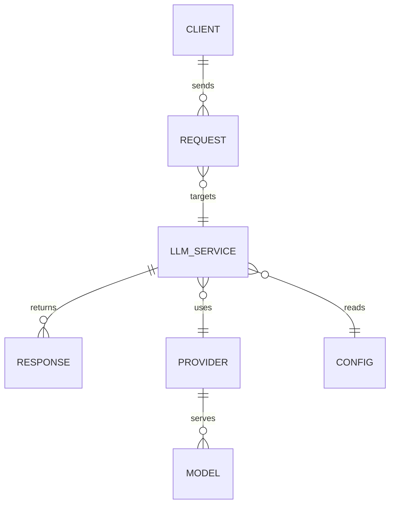

# Relational diagrams

```mermaid
erDiagram
  CLIENT ||--o{ REQUEST : sends
  REQUEST }o--|| LLM_SERVICE : targets
  LLM_SERVICE ||--o{ RESPONSE : returns
  LLM_SERVICE }o--|| PROVIDER : uses
  PROVIDER ||--o{ MODEL : serves
  LLM_SERVICE }o--|| CONFIG : reads
```
